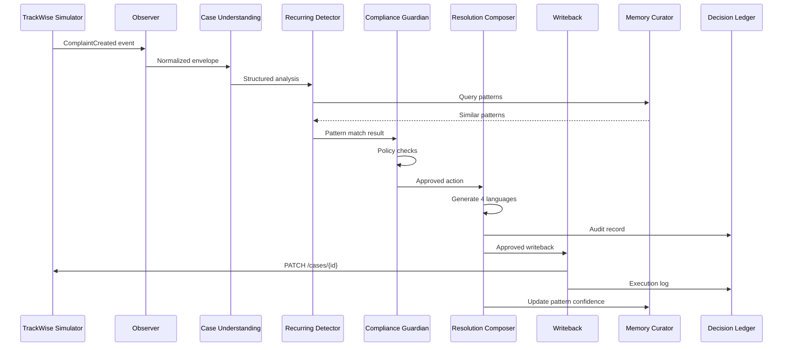
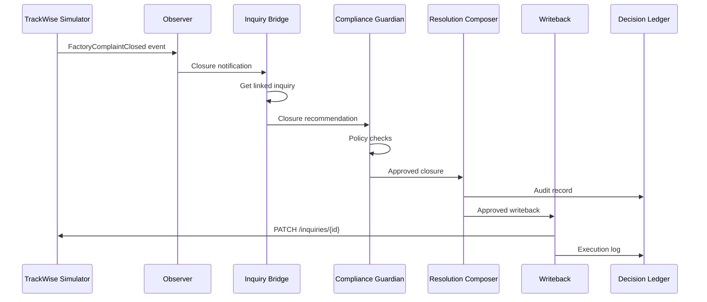
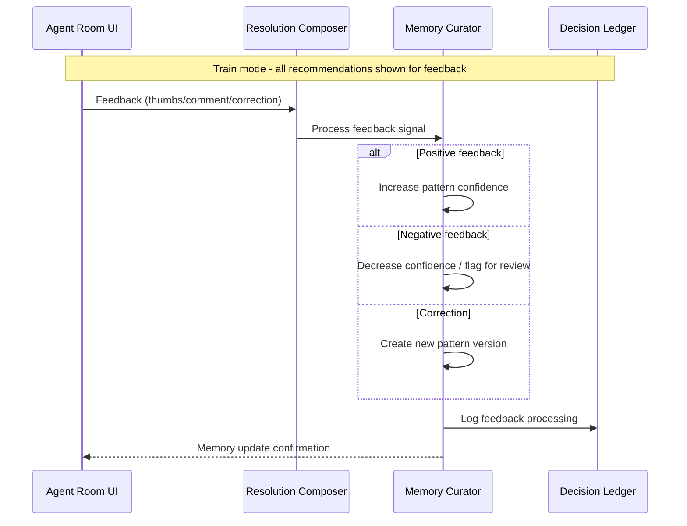
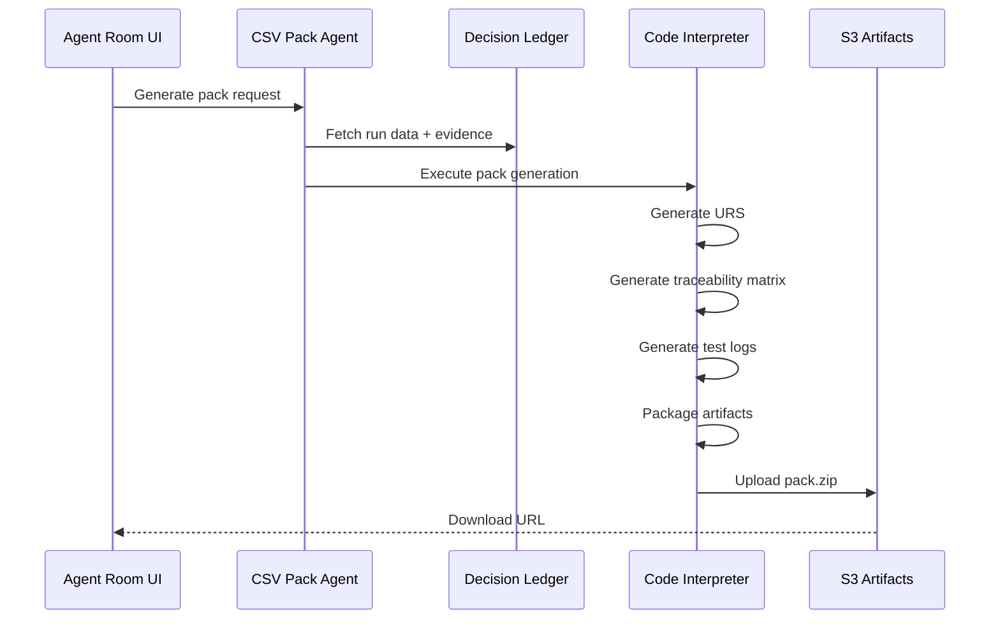

# Agent Architecture Specification

> **Version**: 1.0
> **Last Updated**: January 2026
> **Parent Document**: [PRD.md](./PRD.md)

---

## Table of Contents

1. [Overview](#1-overview)
2. [Architecture Principles](#2-architecture-principles)
3. [A2A Protocol Requirements](#3-a2a-protocol-requirements)
4. [Agent Specifications](#4-agent-specifications)
5. [Agent Communication Flows](#5-agent-communication-flows)
6. [Agent Cards (Discovery)](#6-agent-cards-discovery)
7. [Memory Integration](#7-memory-integration)
8. [Error Handling & Resilience](#8-error-handling--resilience)
9. [Agent Deployment](#9-agent-deployment)

---

## 1. Overview

### 1.1 Multi-Agent Mesh Architecture

The Galderma TrackWise AI Autopilot uses a **10-agent mesh** architecture where specialized agents collaborate via the **A2A (Agent-to-Agent) protocol** on Amazon Bedrock AgentCore Runtime.

This architecture follows the **separation of concerns** principle - each agent has a single, well-defined responsibility, enabling:
- **Modularity**: Agents can be updated/replaced independently
- **Observability**: Clear trace boundaries per agent
- **Scalability**: Agents scale independently based on load
- **Testability**: Each agent can be unit-tested in isolation

### 1.2 Agent Summary Matrix

| # | Agent Name | Model | Role Type | Responsibility |
|---|------------|-------|-----------|----------------|
| 1 | Observer | Gemini 3 Pro (temp 0.5) | Ingestion | Event normalization, envelope creation |
| 2 | Case Understanding | Gemini 3 Pro (temp 0.5) | Analysis | Structure extraction, classification |
| 3 | Recurring Detector | Gemini 3 Pro (temp 0.5) | Analysis | Pattern matching, memory lookup |
| 4 | Compliance Guardian | Gemini 3 Pro (temp 0.3) | Governance | Policy enforcement, evidence validation |
| 5 | Resolution Composer | Gemini 3 Pro (temp 0.3) | Generation | Multi-language output, audit records |
| 6 | Inquiry Bridge | Gemini 3 Pro (temp 0.5) | Orchestration | Inquiry-Complaint linking logic |
| 7 | Writeback | Gemini 3 Pro (temp 0.5) | Execution | Simulator API calls, validation |
| 8 | Memory Curator | Gemini 3 Pro (temp 0.5) | Persistence | Memory management, versioning |
| 9 | CSV Pack | Gemini 3 Pro (temp 0.5) | Generation | Validation documentation |
| 10 | SAC Generator | Gemini 3 Pro (temp 0.8) | Generation | Brazilian consumer complaint generation |

### 1.3 LLM Assignment Rationale

All agents use **Gemini 3.0 Pro** (`gemini-3-pro-preview`) via Strands `GeminiModel` provider. Agent behavior is controlled by **temperature tiering** rather than model tiering, proving the architecture is truly model-agnostic.

| Temperature | Assigned To | Rationale |
|-------------|-------------|-----------|
| **0.3** (Critical) | Compliance Guardian, Resolution Composer | Conservative reasoning for policy enforcement, user-facing outputs |
| **0.5** (Operational) | Observer, Case Understanding, Recurring Detector, Inquiry Bridge, Writeback, Memory Curator, CSV Pack | Balanced reasoning for high-throughput operational tasks |
| **0.8** (Creative) | SAC Generator | Higher creativity for generating realistic Brazilian consumer complaints |

---

## 2. Architecture Principles

### 2.1 OBSERVE → THINK → LEARN → ACT Loop

Per CLAUDE.md requirements, all agents **MUST** follow the iterative learning loop:

```
┌─────────────────────────────────────────────────┐
│                 AGENT LOOP                      │
├─────────────────────────────────────────────────┤
│  OBSERVE → Receive events, gather context       │
│  THINK   → Reason about appropriate action      │
│  LEARN   → Update memory with new knowledge     │
│  ACT     → Execute action (if mode permits)     │
└─────────────────────────────────────────────────┘
```

### 2.2 Human-in-the-Loop (HITL)

Agents **MUST** request human approval when:
- Confidence score falls below threshold
- Action has high-impact consequences
- Mode is "Train" (all decisions show for feedback)
- Policy exceptions are triggered

### 2.3 Sandwich Pattern (CODE → LLM → CODE)

Per CLAUDE.md engineering principle:

```
┌──────────────────┐   ┌──────────────────┐   ┌──────────────────┐
│  CODE (Prepare)  │ → │  LLM (Reason)    │ → │  CODE (Validate) │
├──────────────────┤   ├──────────────────┤   ├──────────────────┤
│ - HTTP requests  │   │ - Intent extract │   │ - Schema check   │
│ - JSON parsing   │   │ - Classification │   │ - Type coercion  │
│ - Auth/headers   │   │ - Decision logic │   │ - Error handling │
│ - Normalization  │   │ - Text generation│   │ - Persistence    │
└──────────────────┘   └──────────────────┘   └──────────────────┘
```

---

## 3. A2A Protocol Requirements

### 3.1 Protocol Specification

| Attribute | Value | Notes |
|-----------|-------|-------|
| **Port** | 9000 | A2A standard (vs 8080 HTTP, 8000 MCP) |
| **Path** | `/` | Root mount point |
| **Protocol** | JSON-RPC 2.0 | Bidirectional messaging |
| **Auth** | SigV4 + OAuth 2.0 | AgentCore Identity |
| **Discovery** | `/.well-known/agent-card.json` | Agent metadata |
| **Content-Type** | `application/json` | All messages |

### 3.2 A2A Message Format

**Request Envelope**:
```json
{
  "jsonrpc": "2.0",
  "id": "req-uuid-12345",
  "method": "tasks/send",
  "params": {
    "id": "task-uuid",
    "message": {
      "role": "user",
      "parts": [
        {
          "type": "text",
          "text": "Process this complaint case"
        },
        {
          "type": "data",
          "data": {
            "case_id": "CASE-001",
            "type": "COMPLAINT",
            "description": "Product defect reported"
          }
        }
      ]
    }
  }
}
```

**Response Envelope**:
```json
{
  "jsonrpc": "2.0",
  "id": "req-uuid-12345",
  "result": {
    "id": "task-uuid",
    "status": {
      "state": "completed"
    },
    "artifacts": [
      {
        "name": "classification_result",
        "parts": [
          {
            "type": "data",
            "data": {
              "category": "PRODUCT_DEFECT",
              "severity": "MEDIUM",
              "confidence": 0.95
            }
          }
        ]
      }
    ]
  }
}
```

### 3.3 Task States

| State | Description |
|-------|-------------|
| `submitted` | Task received, queued for processing |
| `working` | Agent actively processing |
| `input-required` | Waiting for additional input (HITL) |
| `completed` | Successfully finished |
| `failed` | Error occurred |
| `canceled` | Task was canceled |

---

## 4. Agent Specifications

### 4.1 Observer Agent

**Purpose**: Event ingestion and normalization

| Attribute | Value |
|-----------|-------|
| Model | Gemini 3 Pro (temp 0.5) |
| Input | Raw simulator events |
| Output | Normalized event envelopes |
| Tools | None (pure transformation) |

**Responsibilities**:
1. Subscribe to TrackWise Simulator event stream
2. Validate incoming event schema
3. Normalize to standard envelope format
4. Route to appropriate downstream agent
5. Log event receipt to Observability

**Input Events**:
- `ComplaintCreated`
- `ComplaintUpdated`
- `ComplaintClosed`
- `InquiryCreated`
- `InquiryLinkedToComplaint`
- `FactoryComplaintClosed`

**Output Envelope**:
```json
{
  "envelope_id": "string (UUID)",
  "event_type": "string",
  "timestamp": "ISO8601",
  "source": "trackwise_simulator",
  "payload": {
    "case_id": "string",
    "case_type": "COMPLAINT | INQUIRY",
    "raw_data": "object"
  },
  "routing": {
    "next_agent": "case_understanding",
    "priority": "NORMAL | HIGH"
  }
}
```

**System Prompt** (English):
```
You are the Observer Agent for the Galderma TrackWise AI Autopilot system.

Your role:
- Receive raw events from the TrackWise Simulator
- Validate event structure and required fields
- Normalize events into standard envelope format
- Route events to the Case Understanding Agent
- Log all events for observability

Rules:
- Never modify the semantic content of events
- Always include original event in envelope for audit
- Flag high-severity cases for priority routing
- Emit structured logs for every event processed
```

---

### 4.2 Case Understanding Agent

**Purpose**: Extract structured information from case data

| Attribute | Value |
|-----------|-------|
| Model | Gemini 3 Pro (temp 0.5) |
| Input | Normalized event envelopes |
| Output | Structured case analysis |
| Tools | None (LLM reasoning only) |

**Responsibilities**:
1. Extract product, batch/lot, category from free text
2. Assess severity based on content analysis
3. Identify if case matches known patterns
4. Produce structured classification output
5. Route to Recurring Detector and/or Inquiry Bridge

**Output Schema**:
```json
{
  "case_id": "string",
  "extracted": {
    "product_name": "string",
    "batch_lot": "string | null",
    "category": "string (from taxonomy)",
    "subcategory": "string | null",
    "severity_assessment": "LOW | MEDIUM | HIGH | CRITICAL",
    "severity_rationale": "string",
    "key_phrases": ["array of strings"],
    "missing_data": ["array of field names"]
  },
  "classification_confidence": 0.0-1.0,
  "needs_human_review": boolean,
  "routing": {
    "to_recurring_detector": boolean,
    "to_inquiry_bridge": boolean
  }
}
```

**System Prompt** (English):
```
You are the Case Understanding Agent for the Galderma TrackWise AI Autopilot system.

Your role:
- Extract structured information from complaint/inquiry descriptions
- Classify severity based on content analysis
- Identify product, batch/lot, category from free text
- Flag cases with missing required data
- Assess confidence in your classifications

Rules:
- Use the Galderma product taxonomy for categorization
- Flag HIGH or CRITICAL severity for adverse events
- Always provide rationale for severity assessment
- Indicate when confidence is low for human review
- Never fabricate data - flag as missing if not found
```

**Product Taxonomy** (Galderma Categories):
- Dermatology: Acne, Rosacea, Psoriasis, Eczema, Skin Cancer
- Aesthetics: Injectables, Fillers, Skin Quality
- Consumer: Skincare, Haircare, Sun Protection

---

### 4.3 Recurring Detector Agent

**Purpose**: Identify cases matching known patterns

| Attribute | Value |
|-----------|-------|
| Model | Gemini 3 Pro (temp 0.5) |
| Input | Structured case analysis |
| Output | Pattern match results |
| Tools | `memory_query` |

**Responsibilities**:
1. Query AgentCore Memory for similar past cases
2. Calculate semantic similarity scores
3. Identify if case matches "known recurring" patterns
4. Determine if auto-closure is appropriate
5. Provide evidence for pattern match

**Memory Query Tool**:
```json
{
  "tool": "memory_query",
  "parameters": {
    "query": "string (semantic search)",
    "filters": {
      "category": "string",
      "product": "string",
      "min_confidence": 0.8
    },
    "limit": 5
  }
}
```

**Output Schema**:
```json
{
  "case_id": "string",
  "pattern_match": {
    "is_recurring": boolean,
    "matched_pattern_id": "string | null",
    "similarity_score": 0.0-1.0,
    "evidence": {
      "similar_cases": ["array of case IDs"],
      "common_resolution": "string",
      "historical_accuracy": 0.0-1.0
    }
  },
  "recommendation": {
    "action": "AUTO_CLOSE | ESCALATE | HUMAN_REVIEW",
    "confidence": 0.0-1.0,
    "rationale": "string"
  }
}
```

**System Prompt** (English):
```
You are the Recurring Detector Agent for the Galderma TrackWise AI Autopilot system.

Your role:
- Search memory for similar past cases
- Identify if this case matches known recurring patterns
- Calculate confidence in pattern matches
- Recommend auto-close only for high-confidence recurring cases
- Provide evidence linking to historical resolutions

Rules:
- Only recommend AUTO_CLOSE when similarity > 0.90
- Always include evidence from memory
- Flag new patterns for learning consideration
- Never recommend auto-close for HIGH/CRITICAL severity
- Consider product, category, and resolution when matching
```

---

### 4.4 Compliance Guardian Agent

**Purpose**: Policy enforcement and evidence validation

| Attribute | Value |
|-----------|-------|
| Model | Gemini 3 Pro (temp 0.3) |
| Input | Pattern match results, case analysis |
| Output | Policy check results, approval/rejection |
| Tools | `policy_check`, `evidence_validate` |

**Responsibilities**:
1. Verify all required data is present
2. Check against regulatory policies
3. Validate evidence completeness
4. Approve or reject proposed actions
5. Log all policy decisions with rationale

**Policy Check Tool**:
```json
{
  "tool": "policy_check",
  "parameters": {
    "policy_id": "string",
    "case_data": "object",
    "proposed_action": "string"
  }
}
```

**Policies Enforced**:

| Policy ID | Name | Description |
|-----------|------|-------------|
| `POL-001` | Required Fields | All mandatory fields must be populated |
| `POL-002` | Severity Escalation | HIGH/CRITICAL cannot auto-close |
| `POL-003` | Evidence Completeness | All evidence must be attached |
| `POL-004` | Pattern Confidence | Min 0.90 confidence for auto-close |
| `POL-005` | Audit Trail | All decisions must be logged |

**Output Schema**:
```json
{
  "case_id": "string",
  "run_id": "string",
  "compliance_check": {
    "overall_status": "APPROVED | REJECTED | REQUIRES_REVIEW",
    "policy_results": [
      {
        "policy_id": "string",
        "policy_name": "string",
        "passed": boolean,
        "details": "string",
        "evidence_refs": ["array"]
      }
    ]
  },
  "approved_action": "string | null",
  "rejection_reason": "string | null",
  "required_evidence": ["array of missing items"],
  "decision_rationale": "string"
}
```

**System Prompt** (English):
```
You are the Compliance Guardian Agent for the Galderma TrackWise AI Autopilot system.

Your role:
- Enforce regulatory compliance policies
- Validate evidence completeness for all actions
- Approve or reject proposed agent actions
- Ensure audit trail requirements are met
- Block non-compliant actions

Rules:
- NEVER approve auto-close for HIGH/CRITICAL severity
- ALWAYS verify required fields before approval
- REQUIRE pattern confidence >= 0.90 for auto-close
- LOG detailed rationale for every decision
- ESCALATE when uncertain - err on side of caution

Policies you enforce:
- POL-001: Required Fields
- POL-002: Severity Escalation
- POL-003: Evidence Completeness
- POL-004: Pattern Confidence
- POL-005: Audit Trail
```

---

### 4.5 Resolution Composer Agent

**Purpose**: Generate user-facing outputs and audit records

| Attribute | Value |
|-----------|-------|
| Model | Gemini 3 Pro (temp 0.3) |
| Input | Approved action, case data |
| Output | Multi-language outputs, audit records |
| Tools | `translate`, `format_audit` |

**Responsibilities**:
1. Generate canonical (language-neutral) structured output
2. Render 4 language variants simultaneously (PT/EN/ES/FR)
3. Create detailed audit record with reasoning
4. Format outputs for different audiences
5. Include all evidence references

**Multi-Language Generation**:
```json
{
  "canonical_output": {
    "action_taken": "AUTO_CLOSE",
    "structured_summary": {
      "key": "RECURRING_PACKAGING_DEFECT",
      "variables": {
        "product": "Cetaphil Moisturizer",
        "category": "Packaging",
        "similar_cases": 12
      }
    }
  },
  "rendered_outputs": {
    "pt": "Reclamação fechada automaticamente: Defeito de embalagem recorrente identificado para Cetaphil Moisturizer. Este caso corresponde a 12 reclamações anteriores com resolução conhecida.",
    "en": "Complaint auto-closed: Recurring packaging defect identified for Cetaphil Moisturizer. This case matches 12 previous complaints with known resolution.",
    "es": "Queja cerrada automáticamente: Defecto de embalaje recurrente identificado para Cetaphil Moisturizer. Este caso coincide con 12 quejas anteriores con resolución conocida.",
    "fr": "Réclamation clôturée automatiquement: Défaut d'emballage récurrent identifié pour Cetaphil Moisturizer. Ce cas correspond à 12 réclamations précédentes avec résolution connue."
  }
}
```

**Audit Record Format**:
```json
{
  "audit_id": "string (UUID)",
  "run_id": "string",
  "case_id": "string",
  "timestamp": "ISO8601",
  "action": "string",
  "agent_reasoning": {
    "classification_rationale": "string",
    "pattern_match_evidence": ["array"],
    "policy_checks_passed": ["array"],
    "confidence_score": 0.0-1.0
  },
  "outputs_generated": {
    "languages": ["pt", "en", "es", "fr"],
    "canonical_key": "string"
  },
  "evidence_attachments": ["array of refs"]
}
```

**System Prompt** (English):
```
You are the Resolution Composer Agent for the Galderma TrackWise AI Autopilot system.

Your role:
- Generate clear, professional resolution summaries
- Create outputs in 4 languages simultaneously (PT/EN/ES/FR)
- Produce detailed audit records with full reasoning
- Ensure consistency across language variants
- Include all relevant evidence references

Rules:
- ALWAYS store canonical (language-neutral) output first
- GENERATE all 4 language variants in parallel
- MAINTAIN semantic consistency across translations
- INCLUDE agent reasoning chain in audit record
- USE professional, regulatory-appropriate language
- NEVER include speculative information

Output quality standards:
- Clear and concise (max 3 sentences for summary)
- Include key identifiers (product, category, case count)
- Reference evidence for traceability
```

---

### 4.6 Inquiry Bridge Agent

**Purpose**: Handle Inquiry-Complaint linking logic

| Attribute | Value |
|-----------|-------|
| Model | Gemini 3 Pro (temp 0.5) |
| Input | Complaint closure events, inquiry data |
| Output | Inquiry closure recommendations |
| Tools | `get_linked_inquiry` |

**Responsibilities**:
1. Monitor for linked Complaint closures
2. Retrieve associated Inquiry records
3. Generate Inquiry closure summary
4. Route to Compliance Guardian for approval
5. Trigger writeback for approved closures

**Output Schema**:
```json
{
  "inquiry_id": "string",
  "linked_complaint_id": "string",
  "trigger_event": "FACTORY_COMPLAINT_CLOSED",
  "closure_recommendation": {
    "action": "CLOSE_INQUIRY",
    "summary": "string",
    "evidence": {
      "complaint_resolution": "string",
      "complaint_closure_date": "ISO8601"
    }
  }
}
```

**System Prompt** (English):
```
You are the Inquiry Bridge Agent for the Galderma TrackWise AI Autopilot system.

Your role:
- Monitor for Complaint closure events
- Identify linked Inquiry records
- Generate appropriate Inquiry closure summaries
- Route closure recommendations for compliance approval
- Maintain 1:1 Inquiry-Complaint relationship

Rules:
- Only process when linked Complaint is closed
- Copy relevant resolution details from Complaint
- Maintain traceability between records
- Include Complaint closure evidence in Inquiry
```

---

### 4.7 Writeback Agent

**Purpose**: Execute approved actions on TrackWise Simulator

| Attribute | Value |
|-----------|-------|
| Model | Gemini 3 Pro (temp 0.5) |
| Input | Approved actions from Guardian |
| Output | Execution confirmation |
| Tools | `simulator_api`, `validate_writeback` |

**Responsibilities**:
1. Receive approved actions only
2. Validate writeback payload
3. Execute API call to simulator
4. Handle errors and retries
5. Log execution results

**Pre-flight Validation**:
```json
{
  "validation_checks": [
    {"check": "approval_exists", "required": true},
    {"check": "mode_allows_writeback", "required": true},
    {"check": "payload_schema_valid", "required": true},
    {"check": "target_exists", "required": true}
  ]
}
```

**Simulator API Call**:
```json
{
  "tool": "simulator_api",
  "parameters": {
    "method": "PATCH",
    "endpoint": "/cases/{case_id}",
    "payload": {
      "status": "CLOSED",
      "resolution_summary": "string",
      "closed_by": "AGENT_AUTOPILOT",
      "closed_at": "ISO8601"
    }
  }
}
```

**System Prompt** (English):
```
You are the Writeback Agent for the Galderma TrackWise AI Autopilot system.

Your role:
- Execute approved actions on the TrackWise Simulator
- Validate all writebacks before execution
- Handle errors gracefully with retries
- Log all execution attempts and results

Rules:
- NEVER execute without Guardian approval
- ALWAYS validate mode allows writeback (ACT mode only)
- VERIFY payload matches approved action
- LOG all API calls for audit trail
- RETRY up to 3 times on transient errors
```

---

### 4.8 Memory Curator Agent

**Purpose**: Manage agent memory and learning artifacts

| Attribute | Value |
|-----------|-------|
| Model | Gemini 3 Pro (temp 0.5) |
| Input | Run results, feedback signals |
| Output | Memory operations |
| Tools | `memory_write`, `memory_delete`, `memory_version` |

**Responsibilities**:
1. Decide what to persist to memory
2. Version learning artifacts
3. Handle memory updates from feedback
4. Maintain memory hygiene (cleanup)
5. Track memory evolution

**Memory Operations**:

| Operation | Description |
|-----------|-------------|
| `memory_write` | Persist new pattern/knowledge |
| `memory_delete` | Remove incorrect/outdated memory |
| `memory_version` | Create new version of pattern |
| `memory_query` | Read from STM/LTM |

**Memory Entry Schema**:
```json
{
  "memory_id": "string (UUID)",
  "memory_type": "PATTERN | KNOWLEDGE | FEEDBACK",
  "content": {
    "pattern_key": "string",
    "pattern_data": "object",
    "confidence": 0.0-1.0,
    "source_cases": ["array of case IDs"]
  },
  "version": "integer",
  "created_at": "ISO8601",
  "updated_at": "ISO8601",
  "created_by": "agent | human_feedback"
}
```

**System Prompt** (English):
```
You are the Memory Curator Agent for the Galderma TrackWise AI Autopilot system.

Your role:
- Decide what knowledge should be persisted to memory
- Version learning artifacts for traceability
- Process human feedback to update memory
- Maintain memory quality and hygiene
- Track memory evolution over time

Rules:
- Only persist high-confidence patterns (>= 0.85)
- Version all updates (never overwrite)
- Process negative feedback by reducing confidence
- Remove patterns below confidence threshold
- Log all memory operations for audit
```

---

### 4.9 CSV Pack Agent

**Purpose**: Generate Computer System Validation documentation

| Attribute | Value |
|-----------|-------|
| Model | Gemini 3 Pro (temp 0.5) |
| Input | Run data, ledger entries, evidence |
| Output | Validation Pack artifacts |
| Tools | `code_interpreter`, `s3_upload` |

**Responsibilities**:
1. Collect relevant run and ledger data
2. Generate URS document
3. Create traceability matrix
4. Produce test logs
5. Package and upload to S3

**Validation Pack Contents**:

| Artifact | Description | Format |
|----------|-------------|--------|
| `demo_urs.md` | Demo User Requirements Spec | Markdown |
| `risk_assessment.md` | Criticality mapping | Markdown |
| `traceability_matrix.csv` | URS → Test → Evidence | CSV |
| `test_logs.json` | Pass/fail execution logs | JSON |
| `evidence_package.zip` | Trace snapshots + ledger | ZIP |
| `version_manifest.json` | Agent/model versions | JSON |

**Code Interpreter Usage**:
```python
# Example: Generate traceability matrix
import pandas as pd

def generate_traceability_matrix(requirements, test_cases, evidence):
    matrix = []
    for req in requirements:
        linked_tests = [t for t in test_cases if t['req_id'] == req['id']]
        linked_evidence = [e for e in evidence if e['req_id'] == req['id']]
        matrix.append({
            'requirement_id': req['id'],
            'requirement_text': req['text'],
            'test_case_ids': [t['id'] for t in linked_tests],
            'evidence_refs': [e['ref'] for e in linked_evidence],
            'status': 'TRACED' if linked_tests and linked_evidence else 'INCOMPLETE'
        })
    return pd.DataFrame(matrix)
```

**System Prompt** (English):
```
You are the CSV Pack Agent for the Galderma TrackWise AI Autopilot system.

Your role:
- Generate Computer System Validation documentation
- Create demo-level illustrative artifacts
- Produce traceability matrix linking requirements → tests → evidence
- Package all artifacts for download
- Include version information for all components

Rules:
- Generate DEMO-level documentation (illustrative, not production CSV)
- Include clear "DEMO PURPOSES ONLY" disclaimers
- Maintain traceability across all artifacts
- Include version manifest with agent versions, model IDs, prompt hashes
- Upload completed pack to S3 for download
```

---

## 5. Agent Communication Flows

### 5.1 Complaint Auto-Close Flow



### 5.2 Inquiry Auto-Close Flow



### 5.3 Human Feedback Flow (Train Mode)



### 5.4 CSV Pack Generation Flow



---

## 6. Agent Cards (Discovery)

Each agent publishes an Agent Card at `/.well-known/agent-card.json`:

### 6.1 Agent Card Schema

```json
{
  "name": "string",
  "description": "string",
  "url": "string (agent endpoint)",
  "version": "string",
  "provider": {
    "organization": "Galderma Demo",
    "contact": "demo@example.com"
  },
  "documentationUrl": "string",
  "capabilities": {
    "streaming": false,
    "pushNotifications": false,
    "stateTransitionHistory": true
  },
  "authentication": {
    "schemes": ["oauth2", "sigv4"]
  },
  "defaultInputModes": ["text", "data"],
  "defaultOutputModes": ["text", "data"],
  "skills": [
    {
      "id": "string",
      "name": "string",
      "description": "string",
      "inputModes": ["text", "data"],
      "outputModes": ["text", "data"]
    }
  ]
}
```

### 6.2 Example: Compliance Guardian Agent Card

```json
{
  "name": "compliance_guardian",
  "description": "Enforces regulatory compliance policies and validates evidence completeness",
  "url": "https://agents.agentcore.us-east-2.amazonaws.com/compliance-guardian",
  "version": "1.0.0",
  "provider": {
    "organization": "Galderma Demo",
    "contact": "demo@galderma-demo.example.com"
  },
  "capabilities": {
    "streaming": false,
    "pushNotifications": false,
    "stateTransitionHistory": true
  },
  "authentication": {
    "schemes": ["sigv4"]
  },
  "defaultInputModes": ["text", "data"],
  "defaultOutputModes": ["text", "data"],
  "skills": [
    {
      "id": "policy_check",
      "name": "Policy Compliance Check",
      "description": "Validates proposed action against regulatory policies",
      "inputModes": ["data"],
      "outputModes": ["data"]
    },
    {
      "id": "evidence_validate",
      "name": "Evidence Validation",
      "description": "Verifies evidence completeness for audit requirements",
      "inputModes": ["data"],
      "outputModes": ["data"]
    }
  ]
}
```

---

## 7. Memory Integration

### 7.1 AgentCore Memory Configuration

All agents use AgentCore Memory with the following configuration:

```bash
# Memory resource creation
agentcore memory create galderma-demo-memory \
  --strategies '[
    {"semanticMemoryStrategy": {"name": "RecurringPatterns"}},
    {"semanticMemoryStrategy": {"name": "ResolutionTemplates"}},
    {"semanticMemoryStrategy": {"name": "PolicyKnowledge"}}
  ]'
```

### 7.2 Memory Strategies

| Strategy | Purpose | Used By |
|----------|---------|---------|
| `RecurringPatterns` | Store known recurring complaint patterns | Recurring Detector |
| `ResolutionTemplates` | Store successful resolution templates | Resolution Composer |
| `PolicyKnowledge` | Store policy rules and exceptions | Compliance Guardian |

### 7.3 STM vs LTM Usage

| Memory Type | Retention | Use Case |
|-------------|-----------|----------|
| **STM** (Short-term) | 90 days (default) | Conversation context, run state |
| **LTM** (Long-term) | Permanent | Learned patterns, feedback history |

### 7.4 Memory Operations by Agent

| Agent | Read | Write | Delete |
|-------|------|-------|--------|
| Observer | ❌ | ❌ | ❌ |
| Case Understanding | ✅ | ❌ | ❌ |
| Recurring Detector | ✅ | ❌ | ❌ |
| Compliance Guardian | ✅ | ❌ | ❌ |
| Resolution Composer | ✅ | ❌ | ❌ |
| Inquiry Bridge | ✅ | ❌ | ❌ |
| Writeback | ❌ | ❌ | ❌ |
| **Memory Curator** | ✅ | ✅ | ✅ |
| CSV Pack | ✅ | ❌ | ❌ |

---

## 8. Error Handling & Resilience

### 8.1 Error Categories

| Category | Description | Handling |
|----------|-------------|----------|
| `TRANSIENT` | Temporary failures (network, timeout) | Retry with backoff |
| `VALIDATION` | Invalid input/schema | Return error, no retry |
| `POLICY` | Policy violation | Escalate to HITL |
| `SYSTEM` | Infrastructure failure | Alert, circuit breaker |

### 8.2 Retry Strategy

```json
{
  "retry_config": {
    "max_attempts": 3,
    "base_delay_ms": 1000,
    "max_delay_ms": 30000,
    "backoff_multiplier": 2.0,
    "retryable_errors": ["TRANSIENT", "TIMEOUT"]
  }
}
```

### 8.3 Circuit Breaker Pattern

```json
{
  "circuit_breaker": {
    "failure_threshold": 5,
    "success_threshold": 3,
    "timeout_ms": 60000,
    "states": ["CLOSED", "OPEN", "HALF_OPEN"]
  }
}
```

### 8.4 Dead Letter Queue

Failed messages after retry exhaustion:
1. Route to DLQ
2. Alert operations
3. Log full context for debugging
4. Enable manual replay

---

## 9. Agent Deployment

### 9.1 AgentCore Runtime Configuration

Each agent is deployed as an AgentCore Runtime workload:

```hcl
# Terraform example (simplified)
resource "aws_agentcore_agent" "compliance_guardian" {
  name        = "compliance-guardian"
  description = "Compliance Guardian Agent"

  runtime_config {
    model_id    = "gemini-3-pro-preview"
    timeout_ms  = 120000
    memory_mb   = 1024
  }

  a2a_config {
    port = 9000
    path = "/"
    auth = "sigv4"
  }

  memory_resource = aws_agentcore_memory.galderma_demo.arn

  observability {
    log_group     = aws_cloudwatch_log_group.agents.name
    trace_enabled = true
    metrics_enabled = true
  }
}
```

### 9.2 Deployment Order

Due to agent dependencies, deploy in this order:

1. **Infrastructure**: Memory, Observability, Gateway
2. **Foundation Agents**: Observer, Memory Curator
3. **Analysis Agents**: Case Understanding, Recurring Detector
4. **Governance Agents**: Compliance Guardian
5. **Output Agents**: Resolution Composer, Inquiry Bridge
6. **Execution Agents**: Writeback, CSV Pack

### 9.3 Health Checks

Each agent exposes health endpoint at `/health`:

```json
{
  "status": "healthy | degraded | unhealthy",
  "checks": {
    "model_available": true,
    "memory_connected": true,
    "dependencies": {
      "downstream_agent_1": "healthy",
      "downstream_agent_2": "healthy"
    }
  },
  "version": "1.0.0",
  "uptime_seconds": 3600
}
```

---

## Related Documents

- [PRD.md](./PRD.md) - Main requirements document
- [DATA_MODEL.md](./DATA_MODEL.md) - Complete data schemas
- [BUILD_SPEC.md](./BUILD_SPEC.md) - Implementation guide

---

*Document generated based on AWS Strands Agents SDK documentation, Bedrock AgentCore A2A Protocol Contract, and AgentCore Memory specifications.*
