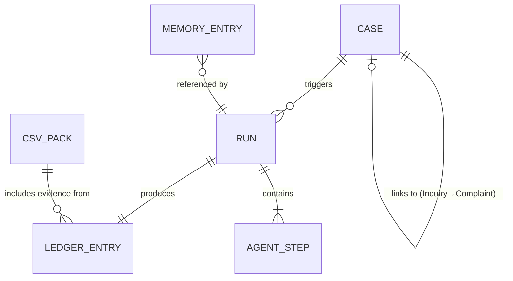

# Data Model Specification

> **Version**: 1.0
> **Last Updated**: January 2026
> **Parent Document**: [PRD.md](./PRD.md)

---

## Table of Contents

1. [Overview](#1-overview)
2. [Core Entities](#2-core-entities)
3. [Relationship Model](#3-relationship-model)
4. [Schema Definitions](#4-schema-definitions)
5. [Event Schemas](#5-event-schemas)
6. [Agent Communication Payloads](#6-agent-communication-payloads)
7. [Memory Schemas](#7-memory-schemas)
8. [API Response Formats](#8-api-response-formats)
9. [Validation Rules](#9-validation-rules)

---

## 1. Overview

### 1.1 Design Principles

The data model follows these principles:

| Principle | Description |
|-----------|-------------|
| **Immutability** | Decision Ledger entries are append-only |
| **Traceability** | Every change links to run_id and evidence |
| **Audit-ready** | Before/after snapshots for all mutations |
| **Language-neutral** | Canonical storage + rendered variants |
| **Schema-first** | Pydantic/JSON Schema validation |

### 1.2 Entity Overview



---

## 2. Core Entities

### 2.1 Entity Summary

| Entity | Description | Storage |
|--------|-------------|---------|
| **Case** | Complaint or Inquiry record | TrackWise Simulator DB |
| **Run** | Single agent execution | DynamoDB |
| **Agent Step** | Individual agent action within a run | Embedded in Run |
| **Decision Ledger Entry** | Immutable audit record | DynamoDB (append-only) |
| **Memory Entry** | Learned pattern/knowledge | AgentCore Memory |
| **CSV Pack** | Validation documentation package | S3 |

### 2.2 Storage Strategy

| Entity | Primary Store | Backup/Archive |
|--------|--------------|----------------|
| Case | Simulator PostgreSQL | N/A (demo) |
| Run | DynamoDB | S3 (cold storage) |
| Ledger Entry | DynamoDB | S3 (compliance archive) |
| Memory Entry | AgentCore Memory | Versioned in AgentCore |
| CSV Pack | S3 | S3 Glacier (archive) |

---

## 3. Relationship Model

### 3.1 Case Relationships

```
┌─────────────────────────────────────────────────────────────┐
│                    CASE RELATIONSHIPS                        │
├─────────────────────────────────────────────────────────────┤
│                                                              │
│  INQUIRY ──────────── 1:1 ───────────► COMPLAINT            │
│     │                                      │                 │
│     │ linked_complaint_id                  │                 │
│     │                                      │                 │
│     └──────────────────────────────────────┘                 │
│                                                              │
│  Note: Each Inquiry links to exactly ONE Complaint           │
│        (simplified for demo purposes)                        │
│                                                              │
└─────────────────────────────────────────────────────────────┘
```

### 3.2 Run Relationships

```
┌─────────────────────────────────────────────────────────────┐
│                     RUN RELATIONSHIPS                        │
├─────────────────────────────────────────────────────────────┤
│                                                              │
│  CASE ─────────── 1:N ───────────► RUN                      │
│                                     │                        │
│                                     │                        │
│  RUN ──────────── 1:1 ───────────► LEDGER_ENTRY             │
│    │                                                         │
│    │                                                         │
│  RUN ──────────── 1:N ───────────► AGENT_STEP               │
│    │                                                         │
│    │                                                         │
│  RUN ──────────── N:N ───────────► MEMORY_ENTRY             │
│        (queries and updates)                                 │
│                                                              │
└─────────────────────────────────────────────────────────────┘
```

---

## 4. Schema Definitions

### 4.1 Case (Complaint / Inquiry)

**Full Schema**:

```json
{
  "$schema": "https://json-schema.org/draft/2020-12/schema",
  "$id": "https://galderma-demo.example.com/schemas/case.json",
  "title": "Case",
  "description": "A complaint or inquiry in the TrackWise Simulator",
  "type": "object",
  "required": ["case_id", "type", "status", "severity", "product", "description", "created_at"],
  "properties": {
    "case_id": {
      "type": "string",
      "format": "uuid",
      "description": "Unique identifier for the case"
    },
    "type": {
      "type": "string",
      "enum": ["COMPLAINT", "INQUIRY"],
      "description": "Type of case"
    },
    "status": {
      "type": "string",
      "enum": ["OPEN", "IN_PROGRESS", "CLOSED", "ESCALATED"],
      "description": "Current case status"
    },
    "severity": {
      "type": "string",
      "enum": ["LOW", "MEDIUM", "HIGH", "CRITICAL"],
      "description": "Severity level"
    },
    "product": {
      "type": "string",
      "description": "Product name from Galderma catalog"
    },
    "batch_lot": {
      "type": ["string", "null"],
      "description": "Batch/lot number if available"
    },
    "category": {
      "type": "string",
      "description": "Complaint category from taxonomy"
    },
    "subcategory": {
      "type": ["string", "null"],
      "description": "Optional subcategory"
    },
    "description": {
      "type": "string",
      "description": "Free-text complaint description"
    },
    "linked_complaint_id": {
      "type": ["string", "null"],
      "format": "uuid",
      "description": "For INQUIRY type: linked complaint ID"
    },
    "resolution_summary": {
      "type": ["string", "null"],
      "description": "Resolution summary when closed"
    },
    "language": {
      "type": "string",
      "enum": ["PT", "EN", "ES", "FR"],
      "default": "EN",
      "description": "Primary language of the case"
    },
    "reporter": {
      "type": "object",
      "properties": {
        "name": { "type": "string" },
        "email": { "type": "string", "format": "email" },
        "country": { "type": "string" }
      }
    },
    "attachments": {
      "type": "array",
      "items": {
        "type": "object",
        "properties": {
          "attachment_id": { "type": "string" },
          "filename": { "type": "string" },
          "content_type": { "type": "string" },
          "size_bytes": { "type": "integer" },
          "url": { "type": "string", "format": "uri" }
        }
      },
      "description": "Simulated attachment references"
    },
    "metadata": {
      "type": "object",
      "properties": {
        "source_system": { "type": "string" },
        "received_channel": { "type": "string" },
        "geographic_region": { "type": "string" }
      }
    },
    "created_at": {
      "type": "string",
      "format": "date-time",
      "description": "ISO8601 creation timestamp"
    },
    "updated_at": {
      "type": "string",
      "format": "date-time",
      "description": "ISO8601 last update timestamp"
    },
    "closed_at": {
      "type": ["string", "null"],
      "format": "date-time",
      "description": "ISO8601 closure timestamp"
    },
    "closed_by": {
      "type": ["string", "null"],
      "enum": ["AGENT_AUTOPILOT", "HUMAN_USER", null],
      "description": "Who closed the case"
    }
  }
}
```

**Example Complaint**:

```json
{
  "case_id": "550e8400-e29b-41d4-a716-446655440001",
  "type": "COMPLAINT",
  "status": "OPEN",
  "severity": "MEDIUM",
  "product": "Cetaphil Daily Facial Moisturizer",
  "batch_lot": "LOT-2026-A1234",
  "category": "Packaging",
  "subcategory": "Seal Defect",
  "description": "Received product with broken seal. Pump dispenser was loose and product had leaked inside the box. This is the third time I've experienced this issue with this product.",
  "linked_complaint_id": null,
  "resolution_summary": null,
  "language": "EN",
  "reporter": {
    "name": "Jane Smith",
    "email": "jane.smith@example.com",
    "country": "United States"
  },
  "attachments": [
    {
      "attachment_id": "att-001",
      "filename": "damaged_packaging.jpg",
      "content_type": "image/jpeg",
      "size_bytes": 245760,
      "url": "s3://demo-attachments/att-001.jpg"
    }
  ],
  "metadata": {
    "source_system": "TrackWise Simulator",
    "received_channel": "Email",
    "geographic_region": "North America"
  },
  "created_at": "2026-01-15T10:30:00Z",
  "updated_at": "2026-01-15T10:30:00Z",
  "closed_at": null,
  "closed_by": null
}
```

**Example Inquiry**:

```json
{
  "case_id": "550e8400-e29b-41d4-a716-446655440002",
  "type": "INQUIRY",
  "status": "OPEN",
  "severity": "LOW",
  "product": "Cetaphil Daily Facial Moisturizer",
  "batch_lot": "LOT-2026-A1234",
  "category": "Product Question",
  "subcategory": "Usage Instructions",
  "description": "Customer inquiry about proper storage temperature for the moisturizer.",
  "linked_complaint_id": "550e8400-e29b-41d4-a716-446655440001",
  "resolution_summary": null,
  "language": "EN",
  "reporter": {
    "name": "Jane Smith",
    "email": "jane.smith@example.com",
    "country": "United States"
  },
  "attachments": [],
  "metadata": {
    "source_system": "TrackWise Simulator",
    "received_channel": "Phone",
    "geographic_region": "North America"
  },
  "created_at": "2026-01-15T11:00:00Z",
  "updated_at": "2026-01-15T11:00:00Z",
  "closed_at": null,
  "closed_by": null
}
```

---

### 4.2 Run / Execution

**Full Schema**:

```json
{
  "$schema": "https://json-schema.org/draft/2020-12/schema",
  "$id": "https://galderma-demo.example.com/schemas/run.json",
  "title": "Run",
  "description": "A single agent execution run",
  "type": "object",
  "required": ["run_id", "case_id", "trigger_event_id", "mode", "started_at"],
  "properties": {
    "run_id": {
      "type": "string",
      "format": "uuid",
      "description": "Unique identifier for the run"
    },
    "case_id": {
      "type": "string",
      "format": "uuid",
      "description": "Case that triggered this run"
    },
    "trigger_event_id": {
      "type": "string",
      "description": "Event ID that initiated the run"
    },
    "trigger_event_type": {
      "type": "string",
      "enum": [
        "ComplaintCreated",
        "ComplaintUpdated",
        "ComplaintClosed",
        "InquiryCreated",
        "InquiryLinkedToComplaint",
        "FactoryComplaintClosed",
        "ManualTrigger"
      ],
      "description": "Type of triggering event"
    },
    "mode": {
      "type": "string",
      "enum": ["OBSERVE", "TRAIN", "ACT"],
      "description": "Autopilot mode during execution"
    },
    "status": {
      "type": "string",
      "enum": ["RUNNING", "COMPLETED", "FAILED", "CANCELLED"],
      "description": "Run execution status"
    },
    "canonical_output": {
      "type": "object",
      "description": "Language-neutral structured output",
      "properties": {
        "action_taken": {
          "type": "string",
          "enum": ["AUTO_CLOSE", "ESCALATE", "OBSERVE_ONLY", "HUMAN_REVIEW", "NO_ACTION"]
        },
        "structured_summary": {
          "type": "object",
          "properties": {
            "key": { "type": "string" },
            "variables": { "type": "object" }
          }
        },
        "confidence_score": {
          "type": "number",
          "minimum": 0,
          "maximum": 1
        }
      }
    },
    "rendered_outputs": {
      "type": "object",
      "description": "Language-specific rendered outputs",
      "properties": {
        "pt": { "type": "string" },
        "en": { "type": "string" },
        "es": { "type": "string" },
        "fr": { "type": "string" }
      },
      "required": ["pt", "en", "es", "fr"]
    },
    "agent_steps": {
      "type": "array",
      "items": { "$ref": "#/$defs/agent_step" },
      "description": "Ordered list of agent actions"
    },
    "tools_used": {
      "type": "array",
      "items": { "type": "string" },
      "description": "List of tool names invoked"
    },
    "memory_operations": {
      "type": "object",
      "properties": {
        "queries": { "type": "integer" },
        "writes": { "type": "integer" },
        "memory_ids_accessed": {
          "type": "array",
          "items": { "type": "string" }
        }
      }
    },
    "metrics": {
      "type": "object",
      "properties": {
        "total_duration_ms": { "type": "integer" },
        "total_tokens_used": { "type": "integer" },
        "agent_count": { "type": "integer" }
      }
    },
    "error": {
      "type": ["object", "null"],
      "properties": {
        "code": { "type": "string" },
        "message": { "type": "string" },
        "agent_name": { "type": "string" },
        "stack_trace": { "type": "string" }
      }
    },
    "started_at": {
      "type": "string",
      "format": "date-time"
    },
    "completed_at": {
      "type": ["string", "null"],
      "format": "date-time"
    }
  },
  "$defs": {
    "agent_step": {
      "type": "object",
      "required": ["step_id", "agent_name", "action", "started_at"],
      "properties": {
        "step_id": { "type": "string" },
        "sequence": { "type": "integer" },
        "agent_name": { "type": "string" },
        "action": { "type": "string" },
        "input": { "type": "object" },
        "output": { "type": "object" },
        "reasoning": { "type": "string" },
        "tools_called": {
          "type": "array",
          "items": {
            "type": "object",
            "properties": {
              "tool_name": { "type": "string" },
              "parameters": { "type": "object" },
              "result": { "type": "object" }
            }
          }
        },
        "duration_ms": { "type": "integer" },
        "tokens_used": { "type": "integer" },
        "model_id": { "type": "string" },
        "started_at": { "type": "string", "format": "date-time" },
        "completed_at": { "type": "string", "format": "date-time" }
      }
    }
  }
}
```

**Example Run**:

```json
{
  "run_id": "run-550e8400-e29b-41d4-a716-446655440099",
  "case_id": "550e8400-e29b-41d4-a716-446655440001",
  "trigger_event_id": "evt-20260115-103000-001",
  "trigger_event_type": "ComplaintCreated",
  "mode": "ACT",
  "status": "COMPLETED",
  "canonical_output": {
    "action_taken": "AUTO_CLOSE",
    "structured_summary": {
      "key": "RECURRING_PACKAGING_DEFECT",
      "variables": {
        "product": "Cetaphil Daily Facial Moisturizer",
        "category": "Packaging",
        "similar_cases_count": 12,
        "pattern_id": "PAT-001"
      }
    },
    "confidence_score": 0.94
  },
  "rendered_outputs": {
    "pt": "Reclamação fechada automaticamente: Defeito de embalagem recorrente identificado para Cetaphil Daily Facial Moisturizer. Este caso corresponde a 12 reclamações anteriores com resolução conhecida.",
    "en": "Complaint auto-closed: Recurring packaging defect identified for Cetaphil Daily Facial Moisturizer. This case matches 12 previous complaints with known resolution.",
    "es": "Queja cerrada automáticamente: Defecto de embalaje recurrente identificado para Cetaphil Daily Facial Moisturizer. Este caso coincide con 12 quejas anteriores con resolución conocida.",
    "fr": "Réclamation clôturée automatiquement: Défaut d'emballage récurrent identifié pour Cetaphil Daily Facial Moisturizer. Ce cas correspond à 12 réclamations précédentes avec résolution connue."
  },
  "agent_steps": [
    {
      "step_id": "step-001",
      "sequence": 1,
      "agent_name": "observer",
      "action": "normalize_event",
      "input": {
        "raw_event": { "event_type": "ComplaintCreated", "case_id": "550e8400-e29b-41d4-a716-446655440001" }
      },
      "output": {
        "envelope_id": "env-001",
        "routing": { "next_agent": "case_understanding" }
      },
      "reasoning": "Valid complaint event received, normalized and routed to Case Understanding",
      "tools_called": [],
      "duration_ms": 45,
      "tokens_used": 150,
      "model_id": "anthropic.claude-haiku-4-5-20251101",
      "started_at": "2026-01-15T10:30:00.100Z",
      "completed_at": "2026-01-15T10:30:00.145Z"
    },
    {
      "step_id": "step-002",
      "sequence": 2,
      "agent_name": "case_understanding",
      "action": "extract_structure",
      "input": {
        "envelope_id": "env-001",
        "description": "Received product with broken seal..."
      },
      "output": {
        "product_name": "Cetaphil Daily Facial Moisturizer",
        "category": "Packaging",
        "severity_assessment": "MEDIUM",
        "classification_confidence": 0.92
      },
      "reasoning": "Extracted product and category from description. Severity MEDIUM due to packaging defect without health impact. High confidence in classification.",
      "tools_called": [],
      "duration_ms": 320,
      "tokens_used": 450,
      "model_id": "anthropic.claude-haiku-4-5-20251101",
      "started_at": "2026-01-15T10:30:00.150Z",
      "completed_at": "2026-01-15T10:30:00.470Z"
    },
    {
      "step_id": "step-003",
      "sequence": 3,
      "agent_name": "recurring_detector",
      "action": "pattern_match",
      "input": {
        "product": "Cetaphil Daily Facial Moisturizer",
        "category": "Packaging"
      },
      "output": {
        "is_recurring": true,
        "matched_pattern_id": "PAT-001",
        "similarity_score": 0.94,
        "similar_cases": ["case-100", "case-101", "case-102"]
      },
      "reasoning": "Found 12 similar cases in memory with same product + category + seal defect. Similarity score 0.94 exceeds threshold.",
      "tools_called": [
        {
          "tool_name": "memory_query",
          "parameters": { "query": "Cetaphil packaging seal defect", "limit": 5 },
          "result": { "matches": 12, "top_pattern_id": "PAT-001" }
        }
      ],
      "duration_ms": 280,
      "tokens_used": 380,
      "model_id": "anthropic.claude-haiku-4-5-20251101",
      "started_at": "2026-01-15T10:30:00.475Z",
      "completed_at": "2026-01-15T10:30:00.755Z"
    },
    {
      "step_id": "step-004",
      "sequence": 4,
      "agent_name": "compliance_guardian",
      "action": "policy_check",
      "input": {
        "proposed_action": "AUTO_CLOSE",
        "severity": "MEDIUM",
        "confidence": 0.94
      },
      "output": {
        "overall_status": "APPROVED",
        "policy_results": [
          { "policy_id": "POL-001", "passed": true },
          { "policy_id": "POL-002", "passed": true },
          { "policy_id": "POL-004", "passed": true }
        ]
      },
      "reasoning": "All policies passed. Severity is MEDIUM (not HIGH/CRITICAL). Confidence 0.94 exceeds 0.90 threshold. Required fields present.",
      "tools_called": [
        {
          "tool_name": "policy_check",
          "parameters": { "policy_ids": ["POL-001", "POL-002", "POL-004"] },
          "result": { "all_passed": true }
        }
      ],
      "duration_ms": 520,
      "tokens_used": 890,
      "model_id": "anthropic.claude-opus-4-5-20251101",
      "started_at": "2026-01-15T10:30:00.760Z",
      "completed_at": "2026-01-15T10:30:01.280Z"
    },
    {
      "step_id": "step-005",
      "sequence": 5,
      "agent_name": "resolution_composer",
      "action": "generate_output",
      "input": {
        "action": "AUTO_CLOSE",
        "pattern_id": "PAT-001",
        "product": "Cetaphil Daily Facial Moisturizer"
      },
      "output": {
        "canonical_key": "RECURRING_PACKAGING_DEFECT",
        "languages_generated": ["pt", "en", "es", "fr"]
      },
      "reasoning": "Generated canonical output with template RECURRING_PACKAGING_DEFECT. Rendered 4 language variants in parallel.",
      "tools_called": [
        {
          "tool_name": "translate",
          "parameters": { "source": "canonical", "targets": ["pt", "en", "es", "fr"] },
          "result": { "success": true }
        }
      ],
      "duration_ms": 780,
      "tokens_used": 1200,
      "model_id": "anthropic.claude-opus-4-5-20251101",
      "started_at": "2026-01-15T10:30:01.285Z",
      "completed_at": "2026-01-15T10:30:02.065Z"
    },
    {
      "step_id": "step-006",
      "sequence": 6,
      "agent_name": "writeback",
      "action": "execute_writeback",
      "input": {
        "case_id": "550e8400-e29b-41d4-a716-446655440001",
        "new_status": "CLOSED"
      },
      "output": {
        "success": true,
        "simulator_response_code": 200
      },
      "reasoning": "Pre-flight validation passed. Executed PATCH to simulator. Case successfully closed.",
      "tools_called": [
        {
          "tool_name": "simulator_api",
          "parameters": { "method": "PATCH", "endpoint": "/cases/550e8400..." },
          "result": { "status_code": 200 }
        }
      ],
      "duration_ms": 150,
      "tokens_used": 180,
      "model_id": "anthropic.claude-haiku-4-5-20251101",
      "started_at": "2026-01-15T10:30:02.070Z",
      "completed_at": "2026-01-15T10:30:02.220Z"
    }
  ],
  "tools_used": ["memory_query", "policy_check", "translate", "simulator_api"],
  "memory_operations": {
    "queries": 1,
    "writes": 0,
    "memory_ids_accessed": ["mem-PAT-001"]
  },
  "metrics": {
    "total_duration_ms": 2120,
    "total_tokens_used": 3250,
    "agent_count": 6
  },
  "error": null,
  "started_at": "2026-01-15T10:30:00.100Z",
  "completed_at": "2026-01-15T10:30:02.220Z"
}
```

---

### 4.3 Decision Ledger Entry

**Full Schema**:

```json
{
  "$schema": "https://json-schema.org/draft/2020-12/schema",
  "$id": "https://galderma-demo.example.com/schemas/ledger_entry.json",
  "title": "DecisionLedgerEntry",
  "description": "Immutable audit record for agent decisions",
  "type": "object",
  "required": ["ledger_id", "run_id", "case_id", "timestamp", "action", "before_snapshot", "after_snapshot"],
  "properties": {
    "ledger_id": {
      "type": "string",
      "format": "uuid",
      "description": "Unique identifier for the ledger entry"
    },
    "run_id": {
      "type": "string",
      "format": "uuid",
      "description": "Associated run ID"
    },
    "case_id": {
      "type": "string",
      "format": "uuid",
      "description": "Associated case ID"
    },
    "timestamp": {
      "type": "string",
      "format": "date-time",
      "description": "When the decision was recorded"
    },
    "action": {
      "type": "string",
      "enum": ["AUTO_CLOSE", "ESCALATE", "OBSERVE_ONLY", "HUMAN_REVIEW", "INQUIRY_CLOSE"],
      "description": "Action taken"
    },
    "before_snapshot": {
      "type": "object",
      "description": "Complete case state before action",
      "properties": {
        "status": { "type": "string" },
        "resolution_summary": { "type": ["string", "null"] },
        "closed_at": { "type": ["string", "null"] },
        "closed_by": { "type": ["string", "null"] }
      }
    },
    "after_snapshot": {
      "type": "object",
      "description": "Complete case state after action",
      "properties": {
        "status": { "type": "string" },
        "resolution_summary": { "type": "string" },
        "closed_at": { "type": "string" },
        "closed_by": { "type": "string" }
      }
    },
    "decision_reason_codes": {
      "type": "array",
      "items": { "type": "string" },
      "description": "Machine-readable reason codes"
    },
    "decision_rationale": {
      "type": "string",
      "description": "Human-readable explanation"
    },
    "policy_checks": {
      "type": "array",
      "items": {
        "type": "object",
        "properties": {
          "policy_id": { "type": "string" },
          "policy_name": { "type": "string" },
          "passed": { "type": "boolean" },
          "details": { "type": "string" }
        }
      },
      "description": "Results of compliance policy checks"
    },
    "evidence_refs": {
      "type": "array",
      "items": {
        "type": "object",
        "properties": {
          "type": {
            "type": "string",
            "enum": ["run_trace", "memory_query", "pattern_match", "attachment"]
          },
          "ref": { "type": "string" },
          "description": { "type": "string" }
        }
      },
      "description": "References to supporting evidence"
    },
    "versions": {
      "type": "object",
      "description": "Version information for traceability",
      "properties": {
        "agent_versions": {
          "type": "object",
          "additionalProperties": { "type": "string" }
        },
        "model_identifier": { "type": "string" },
        "prompt_hash": { "type": "string" },
        "memory_version_ids": {
          "type": "array",
          "items": { "type": "string" }
        }
      }
    },
    "integrity_hash": {
      "type": "string",
      "description": "SHA-256 hash for chain integrity (demo)"
    },
    "previous_ledger_id": {
      "type": ["string", "null"],
      "description": "Previous entry for chain linking"
    }
  }
}
```

**Example Ledger Entry**:

```json
{
  "ledger_id": "led-550e8400-e29b-41d4-a716-446655440500",
  "run_id": "run-550e8400-e29b-41d4-a716-446655440099",
  "case_id": "550e8400-e29b-41d4-a716-446655440001",
  "timestamp": "2026-01-15T10:30:02.220Z",
  "action": "AUTO_CLOSE",
  "before_snapshot": {
    "status": "OPEN",
    "resolution_summary": null,
    "closed_at": null,
    "closed_by": null
  },
  "after_snapshot": {
    "status": "CLOSED",
    "resolution_summary": "Complaint auto-closed: Recurring packaging defect identified for Cetaphil Daily Facial Moisturizer. This case matches 12 previous complaints with known resolution.",
    "closed_at": "2026-01-15T10:30:02.220Z",
    "closed_by": "AGENT_AUTOPILOT"
  },
  "decision_reason_codes": [
    "RECURRING_PATTERN_MATCH",
    "HIGH_CONFIDENCE",
    "SEVERITY_ACCEPTABLE"
  ],
  "decision_rationale": "Case matched recurring pattern PAT-001 with 94% confidence. 12 similar cases resolved with same resolution. Severity MEDIUM permits auto-closure. All compliance policies passed.",
  "policy_checks": [
    {
      "policy_id": "POL-001",
      "policy_name": "Required Fields",
      "passed": true,
      "details": "All mandatory fields populated"
    },
    {
      "policy_id": "POL-002",
      "policy_name": "Severity Escalation",
      "passed": true,
      "details": "Severity MEDIUM - auto-close permitted"
    },
    {
      "policy_id": "POL-004",
      "policy_name": "Pattern Confidence",
      "passed": true,
      "details": "Confidence 0.94 >= threshold 0.90"
    }
  ],
  "evidence_refs": [
    {
      "type": "run_trace",
      "ref": "s3://evidence/runs/run-550e8400.json",
      "description": "Complete run trace with agent steps"
    },
    {
      "type": "memory_query",
      "ref": "mem-query-12345",
      "description": "Memory query showing 12 similar cases"
    },
    {
      "type": "pattern_match",
      "ref": "mem-PAT-001",
      "description": "Matched pattern: Cetaphil packaging seal defect"
    }
  ],
  "versions": {
    "agent_versions": {
      "observer": "1.0.0",
      "case_understanding": "1.0.0",
      "recurring_detector": "1.0.0",
      "compliance_guardian": "1.0.0",
      "resolution_composer": "1.0.0",
      "writeback": "1.0.0"
    },
    "model_identifier": "anthropic.claude-opus-4-5-20251101",
    "prompt_hash": "sha256:abc123def456...",
    "memory_version_ids": ["mem-PAT-001-v3"]
  },
  "integrity_hash": "sha256:789abc123def456789abc123def456789abc123def456789abc123def456789a",
  "previous_ledger_id": "led-550e8400-e29b-41d4-a716-446655440499"
}
```

---

## 5. Event Schemas

### 5.1 Simulator Events

**ComplaintCreated**:
```json
{
  "event_id": "evt-20260115-103000-001",
  "event_type": "ComplaintCreated",
  "timestamp": "2026-01-15T10:30:00Z",
  "source": "trackwise_simulator",
  "payload": {
    "case_id": "550e8400-e29b-41d4-a716-446655440001",
    "type": "COMPLAINT",
    "status": "OPEN",
    "severity": "MEDIUM",
    "product": "Cetaphil Daily Facial Moisturizer",
    "description": "Received product with broken seal..."
  }
}
```

**FactoryComplaintClosed**:
```json
{
  "event_id": "evt-20260115-113000-002",
  "event_type": "FactoryComplaintClosed",
  "timestamp": "2026-01-15T11:30:00Z",
  "source": "trackwise_simulator",
  "payload": {
    "case_id": "550e8400-e29b-41d4-a716-446655440001",
    "type": "COMPLAINT",
    "previous_status": "IN_PROGRESS",
    "new_status": "CLOSED",
    "resolution": "Manufacturing process adjusted",
    "linked_inquiry_ids": ["550e8400-e29b-41d4-a716-446655440002"]
  }
}
```

### 5.2 Normalized Event Envelope

```json
{
  "envelope_id": "env-550e8400-e29b-41d4-a716-446655440100",
  "original_event_id": "evt-20260115-103000-001",
  "event_type": "ComplaintCreated",
  "timestamp": "2026-01-15T10:30:00Z",
  "received_at": "2026-01-15T10:30:00.050Z",
  "source": "trackwise_simulator",
  "payload": {
    "case_id": "550e8400-e29b-41d4-a716-446655440001",
    "case_type": "COMPLAINT",
    "raw_data": { "...complete original payload..." }
  },
  "routing": {
    "next_agent": "case_understanding",
    "priority": "NORMAL"
  },
  "metadata": {
    "observer_version": "1.0.0",
    "validation_passed": true
  }
}
```

---

## 6. Agent Communication Payloads

### 6.1 Case Understanding → Recurring Detector

```json
{
  "jsonrpc": "2.0",
  "id": "req-001",
  "method": "tasks/send",
  "params": {
    "id": "task-detect-001",
    "message": {
      "role": "user",
      "parts": [
        {
          "type": "data",
          "data": {
            "case_id": "550e8400-e29b-41d4-a716-446655440001",
            "extracted": {
              "product_name": "Cetaphil Daily Facial Moisturizer",
              "batch_lot": "LOT-2026-A1234",
              "category": "Packaging",
              "subcategory": "Seal Defect",
              "severity_assessment": "MEDIUM",
              "key_phrases": ["broken seal", "pump dispenser loose", "leaked"]
            },
            "classification_confidence": 0.92
          }
        }
      ]
    }
  }
}
```

### 6.2 Compliance Guardian → Resolution Composer

```json
{
  "jsonrpc": "2.0",
  "id": "req-004",
  "method": "tasks/send",
  "params": {
    "id": "task-compose-001",
    "message": {
      "role": "user",
      "parts": [
        {
          "type": "data",
          "data": {
            "approval_id": "apr-001",
            "approved_action": "AUTO_CLOSE",
            "case_id": "550e8400-e29b-41d4-a716-446655440001",
            "pattern_match": {
              "pattern_id": "PAT-001",
              "similarity_score": 0.94,
              "similar_cases_count": 12
            },
            "policy_checks_passed": ["POL-001", "POL-002", "POL-004"],
            "decision_rationale": "All policies passed. High confidence recurring pattern."
          }
        }
      ]
    }
  }
}
```

---

## 7. Memory Schemas

### 7.1 Pattern Memory Entry

```json
{
  "memory_id": "mem-PAT-001",
  "memory_type": "PATTERN",
  "strategy": "RecurringPatterns",
  "content": {
    "pattern_key": "CETAPHIL_PACKAGING_SEAL_DEFECT",
    "pattern_data": {
      "product_match": "Cetaphil*",
      "category": "Packaging",
      "subcategory": "Seal Defect",
      "key_phrases": ["seal", "broken", "loose", "leak"],
      "standard_resolution": "Known recurring issue. Manufacturing notified. Replacement sent.",
      "resolution_template_id": "RES-TPL-001"
    },
    "confidence": 0.94,
    "source_cases": [
      "case-100", "case-101", "case-102", "case-103", "case-104",
      "case-105", "case-106", "case-107", "case-108", "case-109",
      "case-110", "case-111"
    ],
    "created_from_feedback": false
  },
  "version": 3,
  "created_at": "2025-11-01T00:00:00Z",
  "updated_at": "2026-01-10T15:30:00Z",
  "created_by": "system_learning"
}
```

### 7.2 Resolution Template Memory Entry

```json
{
  "memory_id": "mem-RES-TPL-001",
  "memory_type": "TEMPLATE",
  "strategy": "ResolutionTemplates",
  "content": {
    "template_id": "RES-TPL-001",
    "template_key": "RECURRING_PACKAGING_DEFECT",
    "canonical_template": {
      "summary_format": "Complaint auto-closed: {defect_type} identified for {product}. This case matches {count} previous complaints with known resolution.",
      "variables": ["defect_type", "product", "count"]
    },
    "language_variants": {
      "pt": "Reclamação fechada automaticamente: {defect_type} identificado para {product}. Este caso corresponde a {count} reclamações anteriores com resolução conhecida.",
      "en": "Complaint auto-closed: {defect_type} identified for {product}. This case matches {count} previous complaints with known resolution.",
      "es": "Queja cerrada automáticamente: {defect_type} identificado para {product}. Este caso coincide con {count} quejas anteriores con resolución conocida.",
      "fr": "Réclamation clôturée automatiquement: {defect_type} identifié pour {product}. Ce cas correspond à {count} réclamations précédentes avec résolution connue."
    },
    "usage_count": 45,
    "last_used": "2026-01-15T10:30:00Z"
  },
  "version": 2,
  "created_at": "2025-10-15T00:00:00Z",
  "updated_at": "2026-01-15T10:30:00Z",
  "created_by": "resolution_composer"
}
```

### 7.3 Feedback Memory Entry

```json
{
  "memory_id": "mem-FB-001",
  "memory_type": "FEEDBACK",
  "strategy": "RecurringPatterns",
  "content": {
    "feedback_id": "fb-001",
    "run_id": "run-550e8400-e29b-41d4-a716-446655440099",
    "case_id": "550e8400-e29b-41d4-a716-446655440001",
    "feedback_type": "THUMBS_UP",
    "feedback_signal": "POSITIVE",
    "user_comment": null,
    "correction_data": null,
    "impact": {
      "pattern_id": "PAT-001",
      "confidence_delta": 0.02
    }
  },
  "version": 1,
  "created_at": "2026-01-15T10:35:00Z",
  "updated_at": "2026-01-15T10:35:00Z",
  "created_by": "human_feedback"
}
```

---

## 8. API Response Formats

### 8.1 List Cases Response

```json
{
  "data": [
    {
      "case_id": "550e8400-e29b-41d4-a716-446655440001",
      "type": "COMPLAINT",
      "status": "CLOSED",
      "severity": "MEDIUM",
      "product": "Cetaphil Daily Facial Moisturizer",
      "category": "Packaging",
      "created_at": "2026-01-15T10:30:00Z",
      "is_recurring": true
    }
  ],
  "pagination": {
    "page": 1,
    "page_size": 20,
    "total_items": 156,
    "total_pages": 8
  },
  "filters_applied": {
    "type": "COMPLAINT",
    "status": null,
    "severity": null
  }
}
```

### 8.2 Get Run Response

```json
{
  "data": {
    "run_id": "run-550e8400-e29b-41d4-a716-446655440099",
    "case_id": "550e8400-e29b-41d4-a716-446655440001",
    "status": "COMPLETED",
    "mode": "ACT",
    "action_taken": "AUTO_CLOSE",
    "canonical_output": { "..." },
    "rendered_outputs": { "pt": "...", "en": "...", "es": "...", "fr": "..." },
    "agent_steps_summary": {
      "total_steps": 6,
      "agents_involved": ["observer", "case_understanding", "recurring_detector", "compliance_guardian", "resolution_composer", "writeback"]
    },
    "metrics": {
      "total_duration_ms": 2120,
      "total_tokens_used": 3250
    },
    "started_at": "2026-01-15T10:30:00.100Z",
    "completed_at": "2026-01-15T10:30:02.220Z"
  },
  "links": {
    "full_trace": "/api/runs/run-550e8400.../trace",
    "ledger_entry": "/api/ledger/led-550e8400...",
    "replay": "/api/runs/run-550e8400.../replay"
  }
}
```

### 8.3 Error Response Format

```json
{
  "error": {
    "code": "VALIDATION_ERROR",
    "message": "Required field 'product' is missing",
    "details": {
      "field": "product",
      "constraint": "required",
      "received": null
    },
    "request_id": "req-12345",
    "timestamp": "2026-01-15T10:30:00Z"
  }
}
```

---

## 9. Validation Rules

### 9.1 Case Validation

| Field | Rule | Error Code |
|-------|------|------------|
| `case_id` | Must be valid UUID | `INVALID_UUID` |
| `type` | Must be COMPLAINT or INQUIRY | `INVALID_TYPE` |
| `status` | Must be valid enum value | `INVALID_STATUS` |
| `severity` | Must be valid enum value | `INVALID_SEVERITY` |
| `product` | Required, non-empty string | `REQUIRED_FIELD` |
| `description` | Required, min 10 characters | `MIN_LENGTH` |
| `linked_complaint_id` | Required if type=INQUIRY | `MISSING_LINK` |

### 9.2 Run Validation

| Field | Rule | Error Code |
|-------|------|------------|
| `mode` | Must be OBSERVE, TRAIN, or ACT | `INVALID_MODE` |
| `case_id` | Must reference existing case | `CASE_NOT_FOUND` |
| `agent_steps` | Must have at least 1 step | `EMPTY_STEPS` |

### 9.3 Ledger Entry Validation

| Field | Rule | Error Code |
|-------|------|------------|
| `before_snapshot` | Required, must be valid object | `INVALID_SNAPSHOT` |
| `after_snapshot` | Required, must be valid object | `INVALID_SNAPSHOT` |
| `integrity_hash` | Must match computed hash | `INTEGRITY_VIOLATION` |

### 9.4 Business Rules

| Rule | Description | Enforcement |
|------|-------------|-------------|
| `NO_AUTO_CLOSE_HIGH_SEVERITY` | HIGH/CRITICAL cases cannot be auto-closed | Compliance Guardian |
| `CONFIDENCE_THRESHOLD` | Auto-close requires confidence >= 0.90 | Recurring Detector + Guardian |
| `INQUIRY_REQUIRES_COMPLAINT` | Inquiry must link to existing Complaint | Case Understanding |
| `WRITEBACK_REQUIRES_APPROVAL` | All writebacks need Guardian approval | Writeback Agent |

---

## Appendix: Galderma Product Taxonomy

### Categories

| Category | Subcategories |
|----------|---------------|
| **Dermatology** | Acne, Rosacea, Psoriasis, Eczema, Skin Cancer, Fungal Infections |
| **Aesthetics** | Injectables, Fillers, Skin Quality Treatments |
| **Consumer Skincare** | Moisturizers, Cleansers, Sun Protection |
| **Consumer Haircare** | Shampoos, Treatments |

### Sample Products

| Product | Category |
|---------|----------|
| Cetaphil Daily Facial Moisturizer | Consumer Skincare |
| Cetaphil Gentle Skin Cleanser | Consumer Skincare |
| Differin Gel | Dermatology - Acne |
| Epiduo Forte | Dermatology - Acne |
| Sculptra | Aesthetics - Fillers |
| Restylane | Aesthetics - Fillers |

---

## Related Documents

- [PRD.md](./PRD.md) - Main requirements document
- [AGENT_ARCHITECTURE.md](./AGENT_ARCHITECTURE.md) - Agent specifications
- [BUILD_SPEC.md](./BUILD_SPEC.md) - Implementation guide

---

*Document based on TrackWise QMS data structures, 21 CFR Part 11 audit trail requirements, and AgentCore Memory schema patterns.*
