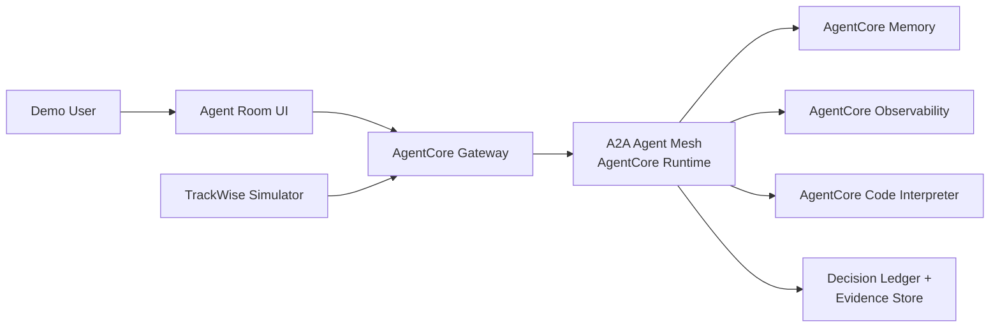
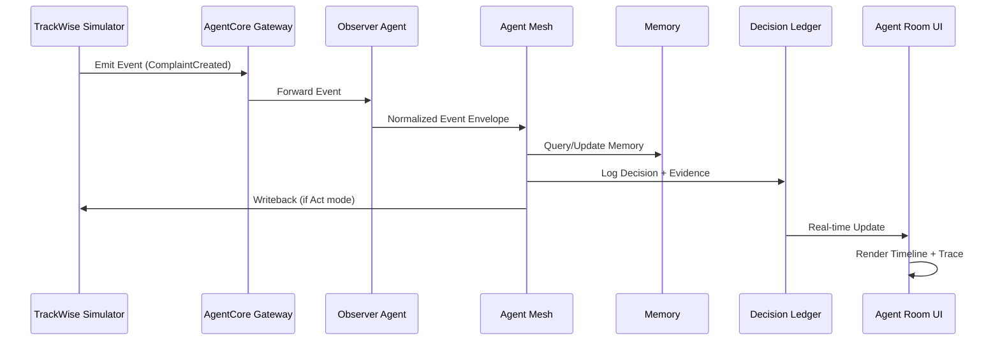
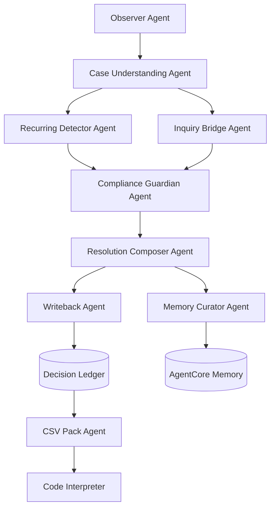

# Galderma TrackWise AI Autopilot (DEMO) — Product Requirements Document

> **Version**: 1.0
> **Status**: Approved
> **Last Updated**: January 2026
> **Language**: English (per project standards)

---

## Table of Contents

1. [Document Purpose](#1-document-purpose)
2. [Product Vision](#2-product-vision)
3. [Goals](#3-goals)
4. [Non-Goals](#4-non-goals)
5. [Target Users](#5-target-users)
6. [Tech Stack](#6-tech-stack)
7. [System Overview](#7-system-overview)
8. [Core Agent Architecture](#8-core-agent-architecture)
9. [Functional Requirements](#9-functional-requirements)
10. [Data Model](#10-data-model)
11. [Security, Identity, and Permissions](#11-security-identity-and-permissions)
12. [Observability](#12-observability)
13. [UI/UX Requirements](#13-uiux-requirements)
14. [Demo Script](#14-demo-script)
15. [Acceptance Criteria](#15-acceptance-criteria)
16. [Implementation Plan](#16-implementation-plan)
17. [Risks and Mitigations](#17-risks-and-mitigations)
18. [Appendix: Interview Decisions](#appendix-interview-decisions)

---

## 1. Document Purpose

This PRD defines the scope, architecture, UX/UI, and delivery requirements for a **sales demo** ("killer demo") showcasing an **AI-first, fully agentic** TrackWise Complaints Autopilot for Galderma.

The demo uses **simulated data** (no real customer data) while demonstrating:
- **Radical transparency** - every agent action is visible and traceable
- **Auditability** - complete audit trail with before/after snapshots
- **Validation thinking (CSV)** - Computer System Validation artifacts generation

> **Important**: CSV in this document refers to **Computer System Validation**, NOT "Comma Separated Values". CSV is the process + documentation + tests that prove a computerized system is fit for intended use, reliable, controlled, and maintains data integrity (21 CFR Part 11).

---

## 2. Product Vision

### Demo Narrative

Galderma's QA teams are overloaded with repetitive work in TrackWise workflows (Complaints + Inquiry/Complaint bridging). This demo proves that **multi-agent AI can assume the cognitive load** end-to-end and still be **more observable and auditable than humans**.

### Key Message

> "Autonomous agents can observe, learn, remember, and execute—while every step is visible, replayable, and exportable for audit/CSV."

### Value Proposition

| Stakeholder | Pain Point | Demo Solution |
|-------------|-----------|---------------|
| QA Ops Lead | Manual case triage backlog | Auto-close recurring complaints |
| Compliance Lead | Audit trail gaps | Complete decision ledger with reasoning |
| IT Security | Uncontrolled AI actions | AgentCore Identity + permissions |
| Executive | Slow time-to-resolution | Real-time autonomous processing |

---

## 3. Goals

### 3.1 Primary Goals

1. **Demonstrate AI-first multi-agent autonomy** for:
   - Auto-closing "known recurring" complaints
   - Auto-closing Inquiry after linked Complaint resolution

2. **Provide a state-of-the-art Agent Room**:
   - Live timeline of events
   - Per-agent trace view
   - Replay of any run ("flight recorder")
   - Memory inspector (what was learned, what was used)
   - A2A agent network visualization (real-time animated)

3. **Demonstrate multi-language (PT/EN/ES/FR) in real time** across:
   - User-facing outputs
   - System messages
   - Agent explanations
   - **Instant toggle** (no re-run required)

4. **Demonstrate CSV/Validation Pack generation**:
   - Requirements → tests → evidence traceability
   - Auto-generated artifacts from agent logs and runs
   - Demo-level illustrative documentation

5. **Implement AWS-native security posture**:
   - Agent identity via AgentCore Identity
   - Controlled permissions
   - Complete audit trails

### 3.2 Secondary Goals

- Show scaling behavior via simulated burst loads (50–500 cases) **visible in demo UI**
- Show "training/certification mode" where humans coach agents, then enable autopilot
- Demonstrate memory learning visibility

---

## 4. Non-Goals

For this demo, the following are explicitly **out of scope**:

| Non-Goal | Rationale |
|----------|-----------|
| Real TrackWise integration | Demo uses simulated data only |
| Real Galderma data | Privacy and compliance concerns |
| Production compliance claim | Demo is "designed to support compliance", not "Part 11 compliant today" |
| Full QMS/CAPA module | Focus on complaints autopilot only |
| Mobile/tablet support | Desktop-only for demo presentations |
| External integrations | 100% simulated environment |

---

## 5. Target Users

### Demo Personas

| Persona | Role | Mindset | Demo Focus |
|---------|------|---------|------------|
| **QA Ops Lead** | Daily backlog owner | Efficiency-focused | Auto-close speed, volume handling |
| **Compliance/Validation Lead** | Skeptical auditor | Risk-averse, documentation-focused | CSV Pack, audit trail, traceability |
| **IT Security Architect** | Identity/permissions guardian | Security-first | AgentCore Identity, permissions, audit |
| **Executive Sponsor** | Decision maker | ROI-focused | Speed + risk control balance |

### Permission Model (MVP)

For the demo MVP, all personas see all features (simplified). No role-based restrictions.

---

## 6. Tech Stack

### 6.1 Agent Framework: AWS Strands (100% MANDATORY)

All agents **MUST** be built with AWS Strands Agents SDK.

**Multi-agent collaboration** via **Agent-to-Agent (A2A)** protocol (Strands-supported).

**References**:
- [Strands A2A Documentation](https://strandsagents.com/latest/documentation/docs/user-guide/concepts/multi-agent/agent-to-agent/)
- [Strands Official Docs](https://strandsagents.com/latest/)
- [AWS Prescriptive Guidance](https://docs.aws.amazon.com/prescriptive-guidance/latest/agentic-ai-frameworks/strands-agents.html)
- [Strands SDK Python](https://github.com/strands-agents/sdk-python)

### 6.2 Runtime & Platform: Amazon Bedrock AgentCore (100% MANDATORY)

Use all AgentCore components:

| Component | Purpose |
|-----------|---------|
| **AgentCore Runtime** | Serverless agent hosting |
| **A2A Protocol Contract** | Agent-to-agent communication |
| **AgentCore Memory** | STM + LTM with semantic strategies |
| **AgentCore Gateway** | API front door |
| **AgentCore Observability** | Logs, traces, metrics |
| **AgentCore Code Interpreter** | CSV Pack generation |
| **AgentCore Identity** | Agent credentials and authorization |

**References**:
- [AgentCore Overview](https://docs.aws.amazon.com/bedrock-agentcore/latest/devguide/what-is-bedrock-agentcore.html)
- [Runtime Service Contract](https://docs.aws.amazon.com/bedrock-agentcore/latest/devguide/runtime-service-contract.html)
- [A2A Protocol Contract](https://docs.aws.amazon.com/bedrock-agentcore/latest/devguide/runtime-a2a-protocol-contract.html)
- [Identity](https://docs.aws.amazon.com/bedrock-agentcore/latest/devguide/identity.html)
- [Observability](https://docs.aws.amazon.com/bedrock-agentcore/latest/devguide/observability-memory-metrics.html)
- [Code Interpreter](https://docs.aws.amazon.com/bedrock-agentcore/latest/devguide/code-interpreter-tool.html)

### 6.3 LLM Policy

Per CLAUDE.md requirements, the following LLM assignment applies:

| Agent Type | Model | Rationale |
|------------|-------|-----------|
| Critical agents | **Claude 4.5 OPUS** | Maximum reasoning for policy enforcement, user-facing outputs |
| Operational agents | **Claude 4.5 Haiku** | Speed + cost efficiency for high-volume tasks |

See [AGENT_ARCHITECTURE.md](./AGENT_ARCHITECTURE.md) for per-agent assignment.

### 6.4 Infrastructure

| Component | Technology | Notes |
|-----------|------------|-------|
| IaC | **Terraform ONLY** | No CloudFormation/SAM per CLAUDE.md |
| Auth | **Amazon Cognito** | No Amplify per CLAUDE.md |
| Region | **us-east-2** | AWS Account 176545286005 |
| CI/CD | **GitHub Actions** | Complete pipeline with Terraform, tests, deploy |
| Deploy Target | **Fresh account friendly** | Terraform creates everything from scratch |

---

## 7. System Overview

### 7.1 System Components

The demo consists of 6 main components:

1. **TrackWise Simulator** - API + event generator + UI for case creation
2. **AgentCore Gateway** - API front door for Agent Room + simulator hooks
3. **Multi-agent mesh (A2A)** - 9 agents deployed on AgentCore Runtime
4. **Agent Room UI** - Apple TV-like frosted dark glass interface
5. **Audit Ledger + Artifacts store** - Immutable event log + downloadable CSV Pack
6. **Memory layer** - AgentCore Memory with STM/LTM

### 7.2 System Context Diagram



### 7.3 Data Flow



---

## 8. Core Agent Architecture

### 8.1 Agent Overview

The system uses 9 specialized agents communicating via A2A protocol:

| # | Agent | Model | Responsibility |
|---|-------|-------|----------------|
| 1 | **Observer** | Haiku | Consume simulator events, produce normalized envelopes |
| 2 | **Case Understanding** | Haiku | Extract structure (product, lot, severity, category, narrative) |
| 3 | **Recurring Detector** | Haiku | Match cases against "known recurring" patterns (memory-driven) |
| 4 | **Compliance Guardian** | **OPUS** | Enforce policy guardrails, ensure evidence completeness |
| 5 | **Resolution Composer** | **OPUS** | Generate user-facing summaries + audit records (4 languages) |
| 6 | **Inquiry Bridge** | Haiku | Generate Inquiry closure when linked Complaint closes |
| 7 | **Writeback** | Haiku | Perform simulator writebacks with pre-flight validation |
| 8 | **Memory Curator** | Haiku | Decide what to persist, version learning artifacts |
| 9 | **CSV Pack** | Haiku | Generate Validation Pack using Code Interpreter |

### 8.2 A2A Agent Graph



### 8.3 A2A Protocol Requirements

- **Port**: 9000 (A2A standard, vs 8080 for HTTP)
- **Path**: `/` (root mount)
- **Discovery**: Agent Cards at `/.well-known/agent-card.json`
- **Protocol**: JSON-RPC for agent-to-agent communication
- **Auth**: SigV4 + OAuth 2.0

For detailed agent specifications, see [AGENT_ARCHITECTURE.md](./AGENT_ARCHITECTURE.md).

---

## 9. Functional Requirements

### 9.1 TrackWise Simulator

**MUST** provide:

| Feature | Description |
|---------|-------------|
| Case CRUD | Create, read, update simulated Complaints & Inquiries |
| Event Emission | ComplaintCreated, ComplaintUpdated, ComplaintClosed, InquiryCreated, InquiryLinkedToComplaint, FactoryComplaintClosed |
| API Endpoints | GET/POST/PATCH cases, webhook/event endpoint to Gateway |
| Realistic UI | Similar to real TrackWise interface |
| Mock Data | Galderma-like categories (dermatology/aesthetics), mix of severities |

### 9.2 Autopilot Modes

**MUST** support three modes:

| Mode | Behavior | UI Indicator |
|------|----------|--------------|
| **Observe** (Shadow) | Agents analyze, produce recommendations, NO writeback | 👁️ Observe |
| **Train** | User provides feedback, memory updated | 🎓 Train |
| **Act** | Agents execute writebacks automatically | ⚡ Act |

**Mode Transitions**: Manual toggle by user in UI (best practice recommendation).

### 9.3 Auto-close Recurring Complaints

**MUST**:
- Detect recurring cases via memory/pattern matching
- Generate closure summary + structured audit record
- Writeback to simulator (in Act mode only)
- Log all steps to Observability + Decision Ledger

### 9.4 Auto-close Inquiry when Complaint Closes

**MUST**:
- When linked complaint closes, generate standardized inquiry closure summary
- Writeback to inquiry record (in Act mode only)
- Log and ledger entries

### 9.5 Multi-language (PT/EN/ES/FR) Real-time

**MUST**:

| Requirement | Implementation |
|-------------|----------------|
| Language options | PT \| EN \| ES \| FR |
| Auto mode | Match input language |
| Toggle | Manual language selector in UI |
| Storage | Canonical output (language-neutral) + 4 rendered variants |
| Switching | **Instant** (no re-run; use cached renders) |
| Generation | **Simultaneous** (4 variants in parallel at run time) |

### 9.6 Agent Room (Radical Transparency)

**MUST** provide:

| Feature | Description |
|---------|-------------|
| Live Timeline | Real-time event stream (WebSocket) |
| Per-run Trace View | Agent steps, inputs/outputs, time, tokens, tools |
| Replay | Select run ID → re-render trace + outputs (**Play + Step-through**) |
| Memory Inspector | View retrieved + written memory, version timeline (**View + Delete**) |
| A2A Network View | Visual graph with **real-time animation** of message flow |
| Download Center | Decision Ledger (JSON), CSV Validation Pack |

### 9.7 CSV / Validation Pack (Demo)

**MUST** automatically generate a "Validation Pack" including:

| Artifact | Description |
|----------|-------------|
| Demo URS | Requirements list |
| Risk Assessment | Simple criticality mapping |
| Traceability Matrix | URS → test cases → evidence |
| Test Logs | Pass/fail execution logs |
| Evidence Attachments | Trace snapshots + ledger excerpts |
| Version Manifest | Agent versions, model ID, prompt hashes |

**Format**: Demo-level illustrative documentation (showing HOW real documentation would look).

Generated by CSV Pack Agent using AgentCore Code Interpreter tool.

### 9.8 Human Feedback Interface (Training Mode)

**MUST** provide all feedback mechanisms:

| Mechanism | Description |
|-----------|-------------|
| Thumbs up/down | Quick binary feedback |
| Comments | Free-text feedback field |
| Correction interface | Edit/correct agent outputs |
| Category selection | Dropdown for correct category |

### 9.9 Burst Load Simulation

**MUST** be visible in demo UI:
- "Simulate Burst" button
- Load range: 50-500 cases
- Real-time metrics display (throughput, latency)

---

## 10. Data Model

### 10.1 Case (Complaint / Inquiry)

```json
{
  "case_id": "string (UUID)",
  "type": "COMPLAINT | INQUIRY",
  "status": "OPEN | IN_PROGRESS | CLOSED | ESCALATED",
  "severity": "LOW | MEDIUM | HIGH | CRITICAL",
  "product": "string",
  "batch_lot": "string",
  "category": "string",
  "description": "string (free text)",
  "linked_complaint_id": "string | null (for inquiry)",
  "resolution_summary": "string | null",
  "language": "PT | EN | ES | FR",
  "attachments": ["array of simulated attachment refs"],
  "created_at": "ISO8601 timestamp",
  "updated_at": "ISO8601 timestamp"
}
```

**Relationship**: 1 Inquiry : 1 Complaint (simple 1:1 mapping)

### 10.2 Run / Execution

```json
{
  "run_id": "string (UUID)",
  "trigger_event_id": "string",
  "mode": "OBSERVE | TRAIN | ACT",
  "canonical_output": "object (language-neutral)",
  "rendered_outputs": {
    "pt": "string",
    "en": "string",
    "es": "string",
    "fr": "string"
  },
  "agent_steps": [
    {
      "agent_name": "string",
      "action": "string",
      "input": "object",
      "output": "object",
      "reasoning": "string",
      "duration_ms": "number",
      "tokens_used": "number"
    }
  ],
  "tools_used": ["array of tool names"],
  "started_at": "ISO8601 timestamp",
  "completed_at": "ISO8601 timestamp"
}
```

### 10.3 Decision Ledger Entry

```json
{
  "ledger_id": "string (UUID)",
  "run_id": "string",
  "timestamp": "ISO8601 timestamp",
  "before_snapshot": "object",
  "after_snapshot": "object",
  "decision_reason_codes": ["array of codes"],
  "policy_checks": [
    {
      "policy_name": "string",
      "passed": "boolean",
      "details": "string"
    }
  ],
  "evidence_refs": ["array of evidence URLs"],
  "versions": {
    "agent_versions": {"agent_name": "version"},
    "model_identifier": "string",
    "prompt_hash": "string",
    "memory_version_ids": ["array"]
  },
  "integrity_hash": "string (chain hash for demo)"
}
```

**Audit Detail Level**: Detailed (steps + reasoning)

For complete schema definitions, see [DATA_MODEL.md](./DATA_MODEL.md).

---

## 11. Security, Identity, and Permissions

### 11.1 AgentCore Identity

**MUST** use AgentCore Identity for:
- Agent credentials
- Authorization between agents
- API access control

### 11.2 Roles (MVP Simplified)

For the demo MVP, all roles see all features:

| Role | Description | MVP Access |
|------|-------------|------------|
| DemoAdmin | Full access | All features |
| QAUser | Train + view | All features |
| ComplianceViewer | View + download | All features |

### 11.3 Gateway Security

- Gateway enforces authentication
- Agents act "on behalf of" user role in demo context
- All actions logged with user context

---

## 12. Observability

### 12.1 Requirements

**MUST** emit from all agents:
- Structured logs
- Traces/spans
- Key metrics (latency, error rate, tool invocations)

### 12.2 Integration

- Enable memory observability metrics
- Agent Room consumes observability data for "live" rendering
- CloudWatch integration for all telemetry

### 12.3 Metrics to Track

| Metric | Description |
|--------|-------------|
| Agent latency | Per-agent response time |
| Token usage | LLM tokens consumed per run |
| Error rate | Failed runs percentage |
| Throughput | Cases processed per minute |
| Memory operations | Read/write counts |

---

## 13. UI/UX Requirements

### 13.1 Design Principles

- **Minimalist** - Clean typography, light text
- **Frosted glass** - Translucent blurred dark surfaces
- **Depth** - Subtle shadows, rounded corners (16-24px)
- **High contrast** - Readability focus
- **Motion** - Gentle transitions, not flashy
- **Desktop only** - Optimized for presentations on large screens

### 13.2 Brand Assets

**Galderma Logo**: Use official asset from galderma.com

**Color Palette**:
- **MUST** auto-extract primary accent colors from logo at build time
- Expected: Dominant teal + deep navy
- Apply as accent gradients for highlights, buttons, active states

### 13.3 UI Layout

**Top Bar**:
- Galderma logo (left)
- Environment badge: "DEMO / SIMULATED DATA"
- Mode switch: Observe | Train | Act
- Language toggle: Auto | PT | EN | ES | FR
- User role badge

**Left Navigation**:
- Agent Room (default landing)
- Cases
- A2A Network
- Memory
- Ledger
- CSV Pack

### 13.4 Main Views

| View | Key Features |
|------|--------------|
| **Agent Room** | Live timeline (center), run details panel (right), agent steps, outputs tab (4 languages), audit tab |
| **Cases** | List with filters (type, status, severity, category, recurring), detail with "Simulate event" and "Generate run" buttons |
| **A2A Network** | Visual graph, health indicators, **real-time animated** message flow |
| **Memory** | Retrieved vs written memory, version timeline, **view + delete** capability |
| **Ledger** | Append-only entries, diff viewer (before/after) |
| **CSV Pack** | "Generate pack" button, pack history, download links |

### 13.5 Component Styling

```css
/* Dark Glassmorphism */
.glass-panel {
  backdrop-filter: blur(16px);
  background: rgba(15, 15, 20, 0.55);
  border-radius: 16px; /* or 24px */
  color: #EAEAF0;
}

/* Fallback for accessibility */
@supports not (backdrop-filter: blur(16px)) {
  .glass-panel {
    background: rgba(15, 15, 20, 0.90);
  }
}
```

For complete design specifications, see [UI_DESIGN_SYSTEM.md](./UI_DESIGN_SYSTEM.md).

---

## 14. Demo Script

### 14.1 Demo Flow (9 Steps)

| Step | Action | Killer Moment |
|------|--------|---------------|
| 1 | Start in **Observe** mode | - |
| 2 | Create 5 simulated complaints (3 recurring, 1 high severity, 1 missing data) | - |
| 3 | Show agents running live (timeline + trace) | **Auto-close in real-time** |
| 4 | Switch languages live (PT→EN→ES→FR) on same run | **Multi-language instant switch** |
| 5 | **Train** mode: provide feedback, show memory update | **Memory learning visible** |
| 6 | **Act** mode: auto-close safe recurring; high severity escalates | - |
| 7 | Trigger "Factory complaint closed" → Inquiry auto-close | - |
| 8 | Replay a run to prove reproducibility | **CSV Pack + Replay** |
| 9 | Generate CSV Validation Pack and download | - |

### 14.2 Killer Demo Moments

1. **Auto-close in real-time** - Seeing a complaint automatically resolved with full explanation
2. **Multi-language instant switch** - Toggling between 4 languages with zero delay
3. **Memory learning visible** - Watching the agent "learn" and apply knowledge
4. **CSV Pack + Replay** - Generating validation documentation with one click

For detailed script with talking points, see [DEMO_SCRIPT.md](./DEMO_SCRIPT.md).

---

## 15. Acceptance Criteria

The demo is considered **"Done"** when:

| # | Criterion | Verification |
|---|-----------|--------------|
| 1 | Demo runs end-to-end without manual debugging | Full script execution |
| 2 | Multi-language toggles instantly across all messages | UI verification |
| 3 | Every run is replayable with agent steps, 4 language outputs, audit record, ledger entry | Replay test |
| 4 | CSV pack generates automatically with traceability + evidence | Download and inspect |
| 5 | All agents deployed on AgentCore Runtime via A2A | Infrastructure check |

---

## 16. Implementation Plan

### 16.1 Phase 1: Core Wow

**Scope**:
- TrackWise Simulator MVP
- AgentCore Gateway setup
- 3 agents: Observer, Resolution Composer, Ledger integration
- Agent Room: Live timeline + language toggle + replay basics

### 16.2 Phase 2: Full Demo

**Scope**:
- Full A2A agent mesh (all 9 agents)
- AgentCore Memory integration
- Code Interpreter (CSV Pack Agent)
- A2A Network view + Memory Inspector
- Train/Act modes with human feedback

---

## 17. Risks and Mitigations

| Risk | Likelihood | Impact | Mitigation |
|------|------------|--------|------------|
| Language hallucinations | Medium | High | Store canonical structured record; render variants; show audit view |
| Observability not integrated | Medium | High | Treat observability as first-class feature; block release if missing |
| Demo feels "too complex" | Low | Medium | Keep UI minimal; use progressive disclosure |
| A2A communication failures | Low | High | Implement health checks, circuit breakers |
| Memory consistency issues | Low | Medium | Version all memory operations, enable rollback |

---

## Appendix: Interview Decisions

### Core Architecture
| Decision | Answer |
|----------|--------|
| Agent Count | 9 agents (confirmed) |
| LLM Policy | OPUS for critical (Guardian, Composer), Haiku for operational |
| Autopilot Modes | Best practices with manual toggle |

### Data & Simulator
| Decision | Answer |
|----------|--------|
| Simulator Fidelity | Realistic mockup (UI similar to TrackWise) |
| Mock Data | Galderma-like categories + severity mix |
| Inquiry:Complaint | 1:1 simple relationship |
| Integration | 100% simulated |

### UI/UX
| Decision | Answer |
|----------|--------|
| Responsive | Desktop only |
| Branding | Auto-extract palette from logo |
| A2A Network View | Real-time animated |
| Memory Inspector | View + Delete |
| Replay Engine | Play + Step-through |
| Burst Load | Visible in demo |

### Features
| Decision | Answer |
|----------|--------|
| Multi-language | Simultaneous generation (4 variants) |
| Human Feedback | All options (thumbs, comments, correction, category) |
| CSV Pack | Demo-level illustrative |
| Audit Detail | Detailed (steps + reasoning) |

### Infrastructure
| Decision | Answer |
|----------|--------|
| Deploy Target | Fresh AWS account friendly |
| CI/CD | Complete GitHub Actions pipeline |
| Test Coverage | Unit tests for critical logic |
| Timeline | ASAP / MVP first |

---

## Related Documents

- [AGENT_ARCHITECTURE.md](./AGENT_ARCHITECTURE.md) - Detailed agent specifications
- [DATA_MODEL.md](./DATA_MODEL.md) - Complete data schemas
- [UI_DESIGN_SYSTEM.md](./UI_DESIGN_SYSTEM.md) - Design system specifications
- [DEMO_SCRIPT.md](./DEMO_SCRIPT.md) - Detailed demo walkthrough
- [BUILD_SPEC.md](./BUILD_SPEC.md) - Technical implementation guide

---

*Document generated with deep research on AWS Strands Agents, Bedrock AgentCore, A2A Protocol, TrackWise QMS, and Computer System Validation (21 CFR Part 11) requirements.*
